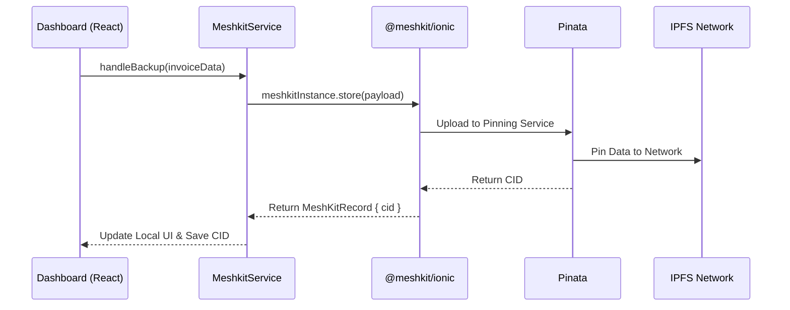

# Government Billing & Invoice Management System

A production-ready **Ionic React + Capacitor** application demonstrating the practical implementation of **MeshKit APIs**. This project serves as a comprehensive Government Billing and Invoice Management System, showcasing how decentralized storage can be seamlessly integrated into a mobile-first enterprise architecture.

---

## Overview

The Government Billing Solution is designed to streamline the creation, management, and auditing of public utility bills and invoices. Rather than relying entirely on centralized servers vulnerable to data loss or tampering, this application uses **MeshKit** to automatically back up critical invoice records to the decentralized web via IPFS (InterPlanetary File System). By anchoring invoice data securely, government agencies can guarantee the integrity, transparency, and longevity of their financial records.

## Why Decentralized Invoice Storage?

Integrating decentralized storage resolves several key challenges in public infrastructure and financial record-keeping:

*   **Data Durability:** Decentralized pinning via Pinata ensures that invoice records are highly available and distributed globally.
*   **Auditability:** Every backed-up invoice generates a cryptographic hash (CID). This tamper-proof identifier acts as a permanent digital fingerprint.
*   **Content Addressing:** Invoices are stored and retrieved by *what* they are (their content hash) rather than *where* they are located, eliminating broken links.
*   **Backup and Recovery:** Continuous decentralized synchronization provides an enterprise-grade disaster recovery layer.

---

## Demo

▶️ **[Watch the Demo Video](https://drive.google.com/file/d/1Y9kHuyeKQJYPeStHXeFZ-vkzNspaB8on/view?usp=sharing)**

---

## Features

### 📄 Invoice Management
*   **Create & Edit Invoices:** Generate bills via an integrated SocialCalc spreadsheet interface.
*   **Local Storage:** Fast, offline-capable indexing of invoices before backing up.
*   **Activity Timeline:** Keep track of creation, backups, and restorations.

### 🌐 MeshKit Integration
*   **IPFS Backups:** Push records directly to decentralized storage using Pinata.
*   **CID Management:** Cryptographically map local invoices to the IPFS network and generate shareable Gateway Links.
*   **Restore via CID:** Recover full invoice histories dynamically from the network.
*   **Interactive Playground:** A dedicated `/meshkit` route to test low-level SDK functions (JSON Storage, File Blob Storage, P2P Messaging).

### 📊 Dashboard
*   **Key Metrics:** Track total invoices created, backed up, restored, files uploaded, and messages sent.
*   **Connection Status:** Real-time monitoring of MeshKit Provider connection health.
*   **CID Explorer:** Built-in tool to directly view pinned IPFS assets.

### 📱 Mobile Support
*   **Ionic React:** Modern, responsive UI components optimized for native performance.
*   **Capacitor:** Seamless access to native device features.
*   **Android:** Ready-to-build Android workspace (`android/` directory included).

---

## Architecture Flow

The application bridges local UI interactions with the decentralized web using the MeshKit wrapper service.



---

## Project Structure

```text
ionic-invoice-meshkit/
├── android/                  # Capacitor-generated native Android project
├── src/
│   ├── app-data.ts           # Mock payload configurations
│   ├── components/           # React components (Dashboard, Modals, SocialCalc)
│   ├── pages/                # Main routing views (Home, MeshKit Playground)
│   ├── services/             # Core logic wrappers (MeshkitService.ts)
│   ├── App.tsx               # Application root and IonReactRouter setup
│   └── main.tsx              # Vite entry point
├── capacitor.config.ts       # Native app configuration
├── package.json              # Dependencies (React, Ionic, Capacitor, MeshKit)
└── vite.config.ts            # Build configuration
```

---

## Installation & Local Development

To run the application locally:

1.  **Clone the repository**
    ```bash
    git clone https://github.com/IPFS-Meshkit/ionic-invoice-meshkit.git
    cd ionic-invoice-meshkit
    ```

2.  **Configure Environment**
    Create a `.env` file based on `.env.example` and add your Pinata JWT:
    ```env
    VITE_PINATA_JWT=your_pinata_jwt_token_here
    ```

3.  **Install dependencies**
    ```bash
    npm install
    ```

4.  **Run the development server**
    ```bash
    npm run dev
    ```

---

## Running on Android

To compile and test the application natively on Android:

1.  **Build the Web Assets**
    ```bash
    npm run build
    ```

2.  **Sync Capacitor**
    ```bash
    npx cap sync android
    ```

3.  **Open in Android Studio**
    ```bash
    npx cap open android
    ```

---

## Documentation

The underlying MeshKit SDK documentation can be found in the **[Ionic-meshkit-release repository](https://github.com/IPFS-Meshkit/Ionic-meshkit-release)**.

*(Please refer to the SDK repository for comprehensive API documentation, method definitions, and low-level decentralized storage implementation details).*
